# Mailchimp Marketing Trends Engine (MVP) Architecture Document

## Introduction / Preamble

This document outlines the overall project architecture for the Mailchimp Marketing Trends Engine (MVP), including backend systems, shared services, and non-UI specific concerns. Its primary goal is to serve as the guiding architectural blueprint for AI-driven development, ensuring consistency and adherence to chosen patterns and technologies.

**Relationship to Frontend Architecture:**
This project includes a significant user interface, detailed in the `ui-ux-spec.md` (UI/UX Specification) and the "User Interaction and Design Goals" section of the `prd.md`. While a separate, dedicated Frontend Architecture Document might be developed by a Design Architect, this document provides the overarching system architecture. Core technology stack choices documented herein (see "Definitive Tech Stack Selections") are definitive for the entire project, including frontend components, which will be built upon the Next.js framework as specified.

## Table of Contents

- [Mailchimp Marketing Trends Engine (MVP) Architecture Document](#mailchimp-marketing-trends-engine-mvp-architecture-document)
  - [Introduction / Preamble](#introduction--preamble)
  - [Table of Contents](#table-of-contents)
  - [Technical Summary](#technical-summary)
  - [High-Level Overview](#high-level-overview)
  - [Component View](#component-view)
    - [Architectural / Design Patterns Adopted](#architectural--design-patterns-adopted)
  - [Project Structure](#project-structure)
    - [Key Directory Descriptions](#key-directory-descriptions)
    - [Notes](#notes)
  - [API Reference](#api-reference)
    - [External APIs Consumed](#external-apis-consumed)
      - [1. Jina AI Reader API (Content Extraction)](#1-jina-ai-reader-api-content-extraction)
      - [2. Jina AI Search API (Secondary Search - For Post-MVP Design)](#2-jina-ai-search-api-secondary-search---for-post-mvp-design)
      - [3. Anthropic Claude API (LLM Content Generation)](#3-anthropic-claude-api-llm-content-generation)
    - [Internal APIs Provided](#internal-apis-provided)
      - [Mailchimp Trends Engine API](#mailchimp-trends-engine-api)
  - [Data Models](#data-models)
    - [1. Core Application Entities / API Payload Schemas (Pydantic Models)](#1-core-application-entities--api-payload-schemas-pydantic-models)
      - [`HealthResponse`](#healthresponse)
      - [`TrendBase` (Base model for Trend information)](#trendbase-base-model-for-trend-information)
      - [`TrendListItem` (For `GET /trends` list items)](#trendlistitem-for-get-trends-list-items)
      - [`TrendListResponse` (Response for `GET /trends`)](#trendlistresponse-response-for-get-trends)
      - [`TrendDataPointSchema` (For historical data points of a trend)](#trenddatapointschema-for-historical-data-points-of-a-trend)
      - [`TrendDetailResponse` (Response for `GET /trends/{trend_id}`)](#trenddetailresponse-response-for-get-trendstrend_id)
      - [`GeneratedContentSchema` (Structure for LLM-generated content)](#generatedcontentschema-structure-for-llm-generated-content)
      - [`LLMContentResponse` (Response for `POST /trends/{trend_id}/generate-content`)](#llmcontentresponse-response-for-post-trendstrend_idgenerate-content)
    - [2. Database Schemas (SQLAlchemy Models)](#2-database-schemas-sqlalchemy-models)
    - [Notes on Data Models](#notes-on-data-models)
  - [Core Workflow / Sequence Diagrams](#core-workflow--sequence-diagrams)
    - [Data Ingestion and Trend Identification Workflow](#data-ingestion-and-trend-identification-workflow)
  - [Definitive Tech Stack Selections](#definitive-tech-stack-selections)
  - [Infrastructure and Deployment Overview](#infrastructure-and-deployment-overview)
  - [Error Handling Strategy](#error-handling-strategy)
  - [Coding Standards](#coding-standards)
    - [Detailed Language \& Framework Conventions](#detailed-language--framework-conventions)
      - [Python (Backend - FastAPI, SQLAlchemy, Pydantic, HTTPX) Specifics](#python-backend---fastapi-sqlalchemy-pydantic-httpx-specifics)
      - [TypeScript (Frontend - Next.js, React, Tailwind CSS, shadcn/ui) Specifics](#typescript-frontend---nextjs-react-tailwind-css-shadcnui-specifics)
  - [Overall Testing Strategy](#overall-testing-strategy)
  - [Security Best Practices](#security-best-practices)
  - [Key Reference Documents](#key-reference-documents)
  - [Change Log](#change-log)

## Technical Summary

The Mailchimp Marketing Trends Engine (MVP) is designed as a web application to identify, process, and visualize marketing trends from online news sources, and generate actionable content ideas using AI. The system architecture employs a **monorepo structure** housing a **Next.js (TypeScript) single-page application (SPA) frontend** and a **Python (FastAPI) "Majestic Monolith" backend**. Key backend components include modules for data ingestion (utilizing Jina AI Reader), Natural Language Processing (NLP with Hugging Face models for topic extraction and sentiment analysis), trend identification, and Large Language Model (LLM) integration (Anthropic Claude for content generation). For the MVP, data storage (raw content, processed data, trends) will be managed using **SQLite accessed via SQLAlchemy**. The entire application stack (frontend and backend) will be **containerized using Docker** and orchestrated locally with **Colima/k3s**, which is also leveraged in the GitHub Actions CI/CD pipeline. This architecture aims to fulfill the PRD goal of rapidly developing a functional prototype that demonstrates real-time trend analysis and AI-powered content ideation, presented through a Mailchimp-aligned user interface.

## High-Level Overview

The Mailchimp Marketing Trends Engine (MVP) employs a **"Majestic Monolith" architecture for the backend** and a **separate Single-Page Application (SPA) for the frontend**, both housed within a **monorepo**.

- **Backend:** A single Python application built with the **FastAPI** framework. It encompasses all business logic, data processing, and external service integrations. While monolithic for MVP deployment, it's designed with clear internal modularity to facilitate potential future evolution into microservices.
- **Frontend:** A **Next.js (TypeScript)** application responsible for all user interaction, data visualization, and communication with the backend via a RESTful API.
- **Repository Structure:** A monorepo will be used to simplify development, dependency management, and CI/CD processes for the interconnected frontend and backend applications.

The primary data flow and user interaction can be summarized as follows:

1. A **Scheduler** within the backend periodically triggers the **Data Ingestion Module**.
2. The **Data Ingestion Module** fetches news articles using the **Jina AI Reader API** and stores the raw content in the **SQLite Database** (via SQLAlchemy).
3. The **NLP Processing Module** retrieves raw content, processes it (cleaning, topic modeling, sentiment analysis using Hugging Face models), and stores the enriched data back in the SQLite Database.
4. The **Trend Identification Module** analyzes the processed data to identify and score marketing trends, storing these in the SQLite Database.
5. The **User** interacts with the **Frontend Application (Next.js SPA)**.
6. The Frontend requests trend data from the **Backend API Module**.
7. For AI content generation, the Frontend sends a request for a selected trend to the Backend API. The **LLM Integration Module** then prompts the **Anthropic Claude API** and returns the generated content ideas to the Frontend via the API.

```mermaid
graph LR
    User["👤 User"] -- "Interacts via Browser" --> FE["Next.js Frontend SPA"];

    subgraph "Monorepo / Local k3s Environment"
        FE -- "HTTP API Calls" --> BE_API["Backend API Module (FastAPI)"];

        subgraph "Backend Application (Majestic Monolith)"
            BE_API -- "Serves Data / Triggers Actions" --> Mod_Core["Core Services (SQLAlchemy, Models)"];
            Scheduler["🕒 Scheduler"] -- "Triggers" --> Mod_Ingestion["Data Ingestion Module"];
            Mod_Ingestion -- "Stores Raw Data" --> DB["SQLite Database"];
            Mod_Ingestion -- "Uses" --> Ext_JinaR["Jina AI Reader API (r.jina.ai)"];
            Mod_NLP["NLP Processing Module"] -- "Reads Raw Data / Stores Processed Data" --> DB;
            Mod_NLP -- "Uses" --> Ext_HF["Hugging Face Models (Local/Hub)"];
            Mod_TrendID["Trend Identification Module"] -- "Reads Processed Data / Stores Trends" --> DB;
            BE_API -- "Requests Trends / Content Ideas" --> Mod_Core;
            Mod_Core -- "Coordinates with" --> Mod_NLP;
            Mod_Core -- "Coordinates with" --> Mod_TrendID;
            Mod_LLM["LLM Integration Module"] -- "Uses" --> Ext_Claude["Anthropic Claude API"];
            Mod_Core -- "Uses" --> Mod_LLM;
        end
    end

    %% Styling for better contrast - Attempt 4
    style User fill:#C9E5FF,stroke:#333,stroke-width:2px,color:#000000
    style FE fill:#A9D18E,stroke:#333,stroke-width:2px,color:#000000
    style BE_API fill:#F4B183,stroke:#333,stroke-width:2px,color:#000000
    style Mod_Core fill:#FFE6CC,stroke:#333,stroke-width:1px,color:#000000
    style Scheduler fill:#FFE6CC,stroke:#333,stroke-width:1px,color:#000000
    style Mod_Ingestion fill:#FFE6CC,stroke:#333,stroke-width:1px,color:#000000
    style Mod_NLP fill:#FFE6CC,stroke:#333,stroke-width:1px,color:#000000
    style Mod_TrendID fill:#FFE6CC,stroke:#333,stroke-width:1px,color:#000000
    style Mod_LLM fill:#FFE6CC,stroke:#333,stroke-width:1px,color:#000000

    %% Forcing high contrast on problematic nodes by using standard colors or defaults
    style DB fill:white,stroke:black,color:black,stroke-width:2px
    style Ext_JinaR fill:yellow,stroke:black,color:black,stroke-width:2px
    style Ext_HF fill:yellow,stroke:black,color:black,stroke-width:2px
    style Ext_Claude fill:yellow,stroke:black,color:black,stroke-width:2px
```

<!-- end list -->



## Component View

The system is composed of two primary applications: the Frontend Application and the Backend Application. The Backend Application itself is a monolith with distinct internal modules.

- **Frontend Application (Next.js SPA)**

  - **Responsibilities:**
    - Provides the user interface (UI) for displaying marketing trends, scores, sentiment, and visualizations.
    - Allows users to filter and interact with trend data.
    - Handles user requests for AI-generated content ideas.
    - Communicates with the Backend API for data retrieval and action triggers.
    - Implements the UI/UX defined in the `ui-ux-spec.md`, ensuring alignment with Mailchimp's aesthetic.
  - **Key Technologies:** Next.js, TypeScript, React, Tailwind CSS, shadcn/ui.

- **Backend Application (FastAPI "Majestic Monolith")**

  - **Responsibilities:**
    - Handles all business logic, data processing, and persistent storage.
    - Integrates with external services (Jina AI, Anthropic Claude).
    - Exposes a RESTful API for the Frontend Application.
  - **Key Technologies:** Python, FastAPI, SQLAlchemy, HTTPX, `uv`.
  - **Internal Modules:**
    - **API Module:**
      - **Responsibilities:** Defines and exposes RESTful API endpoints (e.g., for trends, content generation, health checks). Handles incoming request validation (using Pydantic models), authentication/authorization (basic for MVP), and formats responses.
    - **Data Ingestion Module:**
      - **Responsibilities:** Fetches raw article content from configured news websites using the Jina AI Reader API (`r.jina.ai`). Manages a schedule for periodic fetching. Stores the raw content (text and metadata like source URL, fetch timestamp) into the SQLite database.
    - **NLP Processing Module:**
      - **Responsibilities:** Retrieves raw textual content from the database. Performs NLP tasks: text cleaning (e.g., removing HTML, special characters), tokenization, stop-word removal, lemmatization. Extracts topics/themes using pre-trained Hugging Face transformer models. Conducts sentiment analysis (e.g., positive, negative, neutral) on articles/topics using Hugging Face models. Assesses "marketing relevance" of identified topics based on a configurable marketing keyword ontology. Stores the processed and enriched data (e.g., topics, sentiment scores, relevance flags) in the SQLite database.
    - **Trend Identification Module:**
      - **Responsibilities:** Retrieves processed data (topics, sentiments, relevance) from the database. Implements algorithms to identify emerging marketing trends by analyzing factors like mention frequency, growth rate of topic occurrences, and marketing relevance scores over time. Calculates an overall trend score. Stores the identified trends (including their name, score, sentiment, and supporting data points) in the SQLite database.
    - **LLM Integration Module:**
      - **Responsibilities:** Provides an interface to the Anthropic Claude API. Constructs effective prompts based on selected trend data to generate relevant marketing content ideas (e.g., email subject lines, body copy, campaign themes). Handles API communication, including request/response parsing and error handling. Designed with a pluggable interface to potentially support other LLM providers in the future.
    - **Core Services / Shared Module:**
      - **Responsibilities:** Provides foundational services and shared resources for other backend modules. This includes database interaction logic (SQLAlchemy ORM setup, session management, model definitions for SQLite), Pydantic models for data validation and serialization across API and internal module boundaries, application configuration management (loading settings, environment variables), and potentially other shared utilities or constants.

<!-- end list -->


### Architectural / Design Patterns Adopted

The architecture of the Mailchimp Marketing Trends Engine (MVP) incorporates several key design patterns to meet the project's requirements for rapid development, maintainability, and future extensibility.

- **Monorepo:**

  - **Description:** The entire codebase for both the frontend and backend applications, along with shared configurations and documentation, will reside in a single repository.
  - **Rationale:** Simplifies setup, build processes, dependency management, cross-component refactoring, and CI/CD pipeline configuration for the MVP, especially given the interconnected nature of the frontend and backend.

- **Majestic Monolith (Backend Architecture):**

  - **Description:** The backend is developed as a single, deployable FastAPI application. However, it is internally structured into clearly defined, loosely coupled modules (API, Data Ingestion, NLP Processing, Trend Identification, LLM Integration, Core Services).
  - **Rationale:** This approach accelerates MVP development by reducing deployment complexity compared to microservices. The internal modularity ensures a good separation of concerns, enhances maintainability, and strategically positions the backend for potential future decomposition into microservices if scaling needs dictate.

- **Single-Page Application (SPA) (Frontend Architecture):**

  - **Description:** The frontend is built as an SPA using Next.js, providing a dynamic and interactive user experience.
  - **Rationale:** Delivers a fluid and responsive UI by rendering content primarily on the client-side after the initial page load. Next.js also offers SSR/SSG capabilities that can be leveraged for performance optimization.

- **Modular Design (Backend Internal Structure):**

  - **Description:** Within the backend monolith, functionalities are segregated into distinct Python modules, each with specific responsibilities.
  - **Rationale:** Promotes strong separation of concerns, improves code organization, testability, and maintainability. This clear delineation of responsibilities also makes the system easier to understand and evolve.

- **Repository Pattern (via SQLAlchemy ORM):**

  - **Description:** Data access logic is abstracted through SQLAlchemy, which acts as an Object-Relational Mapper.
  - **Rationale:** Decouples the application's business logic from the specifics of the database implementation (SQLite for MVP, with easier migration to PostgreSQL or others post-MVP). This improves testability by allowing the data layer to be mocked and simplifies changes to the data persistence strategy.

- **Dependency Injection (via FastAPI):**

  - **Description:** FastAPI's built-in support for dependency injection is utilized to manage dependencies within the backend application (e.g., for API route handlers, background tasks, service instantiation).
  - **Rationale:** Enhances modularity and makes components more testable by allowing dependencies to be easily replaced with mocks or fakes during testing. It also improves the overall organization and decoupling of services.

- **Containerization (Docker):**

  - **Description:** Both frontend and backend applications, along with their dependencies, are packaged into Docker containers.
  - **Rationale:** Ensures consistency across development, testing (CI), and local/demo environments. Facilitates portability, simplifies deployment, and is a foundational element for scalability and cloud-native practices.

- **Orchestration (Kubernetes via k3s):**

  - **Description:** k3s (a lightweight Kubernetes distribution) is used for managing containerized applications in the local development/demo environment (via Colima) and within the CI/CD pipeline (GitHub Actions).
  - **Rationale:** Provides a consistent operational paradigm that mirrors production cloud environments, making the application "cloud-ready" by design. It simplifies local multi-container application management.

- **RESTful API:**

  - **Description:** The backend exposes its services to the frontend via a RESTful API.
  - **Rationale:** A standard, stateless, and widely adopted pattern for client-server communication, suitable for the request-response interactions required by the SPA frontend.

- **Pluggable Service Design (LLM Integration & Data Ingestion):**

  - **Description:** The LLM integration module is designed with an interface that can accommodate different LLM providers (Anthropic Claude for MVP). Similarly, the data ingestion mechanism is conceptualized with a pluggable architecture for different data sources.
  - **Rationale:** Provides flexibility and extensibility, allowing the system to adapt to new LLM providers or data sources in the future with minimal architectural changes.

## Project Structure

The Mailchimp Marketing Trends Engine (MVP) will be organized as a monorepo to facilitate development and CI/CD. The structure is designed to clearly separate frontend and backend concerns while adhering to the specified branching and CI/CD strategies and incorporating best-practice tooling configurations.

```plaintext
mailchimp-trends-engine/
├── .github/                    # GitHub specific files
│   ├── pull_request_template.md  # Template for Pull Requests
│   └── workflows/              # GitHub Actions CI/CD pipelines
│       ├── get-version.yml     # Workflow to manage/get project version
│       ├── publish.yml         # Workflow for publishing/releasing (backend focus)
│       └── tests.yml           # Workflow for running tests (frontend & backend)
├── .vscode/                    # VSCode specific settings (optional)
│   └── settings.json
├── backend/                    # Backend Python application (managed with Hatch)
│   ├── bootstrap/              # Scripts for backend environment setup
│   │   └── setup.sh
│   ├── src/
│   │   └── mailchimp_trends/   # Main backend application package
│   │       ├── __init__.py
│   │       ├── main.py         # FastAPI app entry point & root router
│   │       ├── api/            # API routers/endpoints (versioned, e.g., v1/)
│   │       ├── core/           # Core logic, config, constants, Pydantic models
│   │       ├── data_ingestion/ # Jina integration, scheduling
│   │       ├── db/             # Database interaction (SQLAlchemy models, session)
│   │       ├── llm_integration/ # Anthropic Claude API (pluggable LLM service)
│   │       ├── nlp_processing/ # NLP pipeline, topic modeling, sentiment analysis
│   │       ├── schemas/          # Pydantic schemas for API request/response
│   │       └── trend_identification/ # Trend algorithms and scoring
│   ├── tests/                    # Backend unit and integration tests
│   │   ├── __init__.py
│   │   ├── conftest.py         # Pytest fixtures
│   │   └── (mirroring src structure for tests)
│   ├── .env.example              # Example environment variables for backend
│   ├── .pylintrc                 # Pylint configuration for backend
│   ├── .python-version           # Defines Python version for backend (e.g., for pyenv)
│   ├── .ruff.toml                # Ruff linter/formatter configuration for backend
│   ├── Dockerfile                # Docker build instructions for backend
│   ├── Makefile                  # Makefile for backend-specific tasks (test, lint, etc.)
│   └── pyproject.toml            # Python project metadata, dependencies, build config (for Hatch)
├── docs/                       # Project documentation
│   ├── prd.md
│   ├── architecture.md         # This document
│   ├── ui-ux-spec.md
│   └── assets/                 # Supporting images or diagrams for docs
├── frontend/                   # Frontend Next.js application
│   ├── app/                    # Next.js App Router (pages, layouts, components)
│   ├── components/             # Shared UI components (shadcn/ui based)
│   ├── public/                 # Static assets (images, fonts, etc.)
│   ├── styles/                 # Global styles, Tailwind CSS base
│   ├── lib/                    # Helper functions, API client, etc.
│   ├── .env.local.example      # Example environment variables for frontend
│   ├── Dockerfile              # Docker build instructions for frontend
│   ├── package.json            # Frontend dependencies and scripts (pnpm)
│   ├── pnpm-lock.yaml
│   └── tsconfig.json           # TypeScript configuration for frontend
├── kubernetes/                 # Kubernetes manifests for local Colima/k3s deployment
│   ├── backend-deployment.yaml
│   ├── frontend-deployment.yaml
│   └── (services, configmaps, etc.)
├── .cspell.json                # cspell spell checker configuration (root)
├── .gitignore                  # Git ignore rules
├── .markdownlint.json          # Markdownlint configuration (root)
├── Makefile                    # Root-level Makefile to orchestrate frontend & backend tasks
├── pnpm-workspace.yaml         # Defines the pnpm monorepo workspaces
└── README.md                   # Project overview, setup, and run instructions
```

### Key Directory Descriptions

- **`.github/`**: Contains GitHub-specific configurations.
  - **`pull_request_template.md`**: The default template used for creating new pull requests.
  - **`workflows/`**: Defines GitHub Actions CI/CD pipelines (`get-version.yml`, `publish.yml`, `tests.yml`).
- **`backend/`**: Houses the Python FastAPI application, managed using **Hatch**.
  - **`backend/bootstrap/setup.sh`**: Script to initialize the backend development environment (e.g., using `uv sync`).
  - **`backend/app/`**: The main source code package for the backend, with subdirectories for `api`, `core`, `data_ingestion`, `db`, `llm_integration`, `nlp_processing`, `schemas`, `trend_identification`.
  - **`backend/tests/`**: Unit and integration tests for the backend.
  - **`backend/.pylintrc`**: Configuration for Pylint.
  - **`backend/.python-version`**: Specifies the target Python version for the backend.
  - **`backend/.ruff.toml`**: Configuration for the Ruff linter and formatter.
  - **`backend/Dockerfile`**: Instructions for building the backend Docker image.
  - **`backend/Makefile`**: Makefile for backend-specific development tasks (e.g., running tests, linters, build).
  - **`backend/pyproject.toml`**: Defines project metadata, dependencies, and build system configuration for the Python backend (Hatch, `uv`).
- **`docs/`**: Contains all project documentation (PRD, Architecture, UI/UX Spec, etc.).
- **`frontend/`**: Houses the Next.js (TypeScript) application, managed with `pnpm`.
  - Contains standard Next.js directories like `app/`, `components/`, `lib/`, `public/`, `styles/`.
  - **`frontend/Dockerfile`**: Instructions for building the frontend Docker image.
  - **`frontend/package.json`**: Defines dependencies and scripts for the frontend.
- **`kubernetes/`**: Contains Kubernetes manifest files (YAML) for local Colima/k3s deployment.
- **`.cspell.json`**: Root-level configuration for the cspell spell checker.
- **`.gitignore`**: Specifies intentionally untracked files for the entire monorepo.
- **`.markdownlint.json`**: Root-level configuration for Markdown linting.
- **`Makefile` (Root Level)**: A top-level Makefile to orchestrate common tasks across both frontend and backend (e.g., `make setup-all`, `make test-all`, `make build-all`).
- **`pnpm-workspace.yaml`**: Configuration file for `pnpm` to manage the monorepo workspaces.
- **`README.md`**: Provides a high-level overview of the project, setup instructions, etc.

### Notes

- **Branching Strategy:** The project will adhere to a disciplined branching model with `main` and `develop` as the primary branches. All new features and fixes will be developed in separate feature branches, with pull requests made against the `develop` branch for review and testing before merging. The `main` branch will represent stable releases.
- **Backend Versioning:** The backend application's version will be managed using Hatch/Hatchling.
- Environment variables (`.env` files) should be listed in `.gitignore` and not committed. Example files will be provided in `backend/` and `frontend/`.
- Python virtual environments (e.g., `.venv` in `backend/`) and `node_modules` directories will be git-ignored.

## API Reference

### External APIs Consumed

This section details the external APIs that the Mailchimp Marketing Trends Engine will interact with.

#### 1\. Jina AI Reader API (Content Extraction)

- **Purpose:** To fetch and extract the primary textual content from online news articles identified as potential sources of marketing trends.
- **Base URL(s):**
  - Production: `https://r.jina.ai/`
- **Authentication:**
  - No API key is strictly required for basic use of `r.jina.ai/URL`, which operates on a free tier with lower rate limits (e.g., 20 RPM).
  - An optional `X-API-Key: <JINA_API_KEY>` header can be provided if a Jina AI API key is obtained, which typically grants higher rate limits. For MVP, we will operate within the keyless free tier limits.
- **Key Endpoints Used:**
  - **`GET /{URL_to_read}`**
    - **Description:** Retrieves the specified URL, processes its content, and returns the main textual content in an LLM-friendly format (typically Markdown or plain text).
    - **Request Parameters:**
      - `URL_to_read` (Path parameter): The full, URL-encoded web address of the target page to read (e.g., `https://r.jina.ai/https://www.example.com/news-article`).
    - **Request Headers (Recommended):**
      - `Accept: text/plain` (to request plain text output, Markdown is often default)
      - `User-Agent: MailchimpTrendsEngine/1.0` (or similar, to be a good internet citizen)
    - **Request Body Schema:** N/A (GET request)
    - **Example Request (cURL):**

        ```bash
        curl -L -H "Accept: text/plain" "https://r.jina.ai/https://www.theverge.com/2023/10/26/23933445/ai-images-news-reporting-ethics-guidelines"
        ```

    - **Success Response Schema (Code: `200 OK`):**
      - `Content-Type: text/plain; charset=utf-8` (or `text/markdown`)
      - Body: (String) The extracted textual content of the webpage.
    - **Error Response Schema(s) (Codes: `4xx`, `5xx`):**
      - The API may return standard HTTP error codes. Error details might be in plain text or a JSON object. (e.g., `400 Bad Request` for invalid URL format, `403 Forbidden` if access is blocked, `500 Internal Server Error`).
      - Example JSON Error (hypothetical, actual may vary):

        ```json
        { "error": "Failed to fetch URL", "details": "Timeout while trying to load the page" }
        ```

    - **Example Response (Success, Plain Text):**

        ```text
        The article discusses the ethical guidelines for using AI-generated images in news reporting...
        (Rest of the extracted article content)
        ```

- **Rate Limits:**
  - Without API Key: 20 RPM (Requests Per Minute) as per Jina AI documentation (May 2025).
  - The system must respect these limits and implement appropriate delays or queuing if fetching many URLs.
- **Link to Official Docs:** [https://jina.ai/reader/](https://jina.ai/reader/) and [https://github.com/jina-ai/reader](https://github.com/jina-ai/reader)

#### 2\. Jina AI Search API (Secondary Search - For Post-MVP Design)

- **Purpose:** (Post-MVP) To perform focused secondary web searches based on initially identified topics to gather more marketing-specific context. This is a design consideration for future expansion.
- **Base URL(s):**
  - Production: `https://s.jina.ai/`
- **Authentication:**
  - Requires an API key. Typically sent via `Authorization: Bearer <JINA_API_KEY>` header or `X-API-Key: <JINA_API_KEY>` header. The `JINA_API_KEY` would be stored securely as an environment variable.
- **Key Endpoints Used (Conceptual for MVP design):**
  - **`GET /?q={search_query}`** or **`GET /search?q={search_query}`**
    - **Description:** Performs a web search for the given `search_query` and returns a list of relevant page URLs and their extracted LLM-friendly content.
    - **Request Parameters:**
      - `q` (Query parameter): The URL-encoded search query string.
      - Optionally, other parameters like `site=` to restrict search to specific domains.
    - **Request Headers:**
      - `Authorization: Bearer <JINA_API_KEY>` (or `X-API-Key: <JINA_API_KEY>`)
      - `Accept: application/json` (typically returns structured data)
    - **Request Body Schema:** N/A (GET request)
    - **Example Request (cURL):**

        ```bash
        curl -H "Authorization: Bearer YOUR_JINA_API_KEY" "https://s.jina.ai/?q=latest+AI+marketing+tools"
        ```

    - **Success Response Schema (Code: `200 OK`):** (JSON)
      - Typically a list of search result objects. Each object might contain:

        ```json
        [
            {
            "url": "https://example.com/result1",
            "title": "Example Result 1 Title",
            "content": "Extracted content from result 1..."
            },
            {
            "url": "https://another.com/result2",
            "title": "Example Result 2 Title",
            "content": "Extracted content from result 2..."
            }
        ]
        ```

    - **Error Response Schema(s) (Codes: `4xx`, `5xx`):**
      - JSON error object (e.g., `{"error": "Invalid API Key", "details": "..."}`).
- **Rate Limits:**
  - Depends on the API key tier (e.g., 100 RPM with a basic API key as per Jina AI documentation - May 2025). Refer to official Jina AI documentation.
- **Link to Official Docs:** [https://jina.ai/reader/](https://jina.ai/reader/) (The same documentation covers `s.jina.ai` capabilities)

#### 3\. Anthropic Claude API (LLM Content Generation)

- **Purpose:** To generate relevant marketing content ideas (e.g., email subject lines, body copy, campaign themes) based on a selected trend, using a powerful Large Language Model.
- **Base URL(s):**
  - Production: `https://api.anthropic.com/v1`
- **Authentication:**
  - API Key sent in the header: `x-api-key: <CLAUDE_API_KEY>`.
  - The `<CLAUDE_API_KEY>` will be stored securely as an environment variable.
- **Key Endpoints Used:**
  - **`POST /messages`**
    - **Description:** Sends a prompt (or a sequence of messages) to a specified Claude model and receives a generated message in response.
    - **Request Headers:**
      - `x-api-key: <CLAUDE_API_KEY>`
      - `anthropic-version: 2023-06-01` (Recommended by Anthropic docs)
      - `Content-Type: application/json`
    - **Request Body Schema (JSON):**

        ```json
        {
            "model": "claude-3-haiku-20240307", // Using Haiku for cost-effectiveness in MVP
            "max_tokens": 1500, // Adjust based on expected output length for content ideas
            "messages": [
            {
                "role": "user",
                "content": "Based on the marketing trend topic '[Trend Topic Name]' which has a general sentiment of '[Trend Sentiment]' and a trend score of [Trend Score], please generate the following for Mailchimp campaigns:\n1. Three concise email subject line ideas.\n2. One short paragraph (2-3 sentences) of engaging email body copy.\n3. One overall campaign theme idea."
            }
            // Optionally, can include previous assistant messages if building a conversation
            ]
            // Other parameters like "temperature", "system" prompt can be added if needed.
        }
        ```

    - **Example Request (cURL):**

        ```bash
        curl https://api.anthropic.com/v1/messages \
                --header "x-api-key: $CLAUDE_API_KEY" \
                --header "anthropic-version: 2023-06-01" \
                --header "content-type: application/json" \
                --data '{
                "model": "claude-3-haiku-20240307",
                "max_tokens": 1024,
                "messages": [
                    {"role": "user", "content": "Generate three email subject lines for a trend about sustainable packaging."}
                ]
                }'
        ```

    - **Success Response Schema (Code: `200 OK`) (JSON):**

        ```json
        {
            "id": "msg_xxxxxxxxxxxx",
            "type": "message",
            "role": "assistant",
            "model": "claude-3-haiku-20240307", // Model that generated the response
            "content": [
            {
                "type": "text",
                "text": "Here are three email subject line ideas for the sustainable packaging trend:\n1. Go Green: Unwrap Our New Eco-Friendly Packaging!\n2. Sustainable Choices, Stylish Delivery.\n3. Packaging That Loves Our Planet (And Your Products!)."
            }
            ],
            "stop_reason": "end_turn", // e.g., "end_turn", "max_tokens"
            "stop_sequence": null,
            "usage": {
            "input_tokens": 25, // Example
            "output_tokens": 50  // Example
            }
        }
        ```

    - **Error Response Schema(s) (Codes: `4xx`, `5xx`) (JSON):**
      - Anthropic API returns a JSON error object.
      - Example (`401 Unauthorized`):

        ```json
        {
            "type": "error",
            "error": {
            "type": "authentication_error",
            "message": "Invalid API Key"
            }
        }
        ```

      - Example (`400 Bad Request` for invalid request structure):

        ```json
        {
            "type": "error",
            "error": {
            "type": "invalid_request_error",
            "message": "messages: must be a list of objects with role and content"
            }
        }
        ```

- **Rate Limits:**
  - Dependent on the user's Anthropic account tier. For MVP, operate within free/developer tier limits. Refer to official Anthropic documentation for specifics.
- **Link to Official Docs:** [https://docs.anthropic.com/claude/reference/messages\_post](https://www.google.com/search?q=https://docs.anthropic.com/claude/reference/messages_post)

### Internal APIs Provided

This section details the APIs exposed by the FastAPI backend for consumption by the frontend application or other potential internal services.

#### Mailchimp Trends Engine API

- **Purpose:** To provide marketing trend data, visualizations, and AI-generated content ideas to the frontend client.
- **Base URL(s):** `/api/v1`
- **Authentication/Authorization:**
  - For MVP local development (Colima/k3s): None.
  - For future staging/production deployments beyond local k3s: An API key mechanism or other token-based authentication (e.g., JWT) should be considered and implemented. This is out of scope for the initial MVP build but the design should not preclude it.
- **General Error Response Schema:**
  - FastAPI's default validation errors (on `422 Unprocessable Entity`) provide detailed JSON output.
  - For other client errors (e.g., `400`, `404`) and server errors (`500`), a consistent JSON response will be provided:

    ```json
    // Example for 404 Not Found
    {
        "detail": "Resource not found."
    }

    // Example for 500 Internal Server Error
    {
        "detail": "An unexpected error occurred on the server."
        // "error_id": "generated-uuid-for-logging" // Optional for tracing
    }
    ```

**Endpoints:**

1. **Health Check**

      - **`GET /health`**
          - **Description:** Checks the operational status of the backend service.
          - **Request Parameters:** None.
          - **Request Body Schema:** N/A.
          - **Success Response Schema (Code: `200 OK`):**

            ```json
            {
              "status": "healthy",
              "version": "x.y.z" // Backend version
            }
            ```

          - **Error Response Schema(s):** Unlikely for a basic health check, but could be `503 Service Unavailable` if a critical dependency is down.

2. **Trends**

      - **`GET /trends`**

          - **Description:** Retrieves a list of identified marketing trends. Supports filtering, sorting, and pagination.
          - **Request Parameters (Query):**
              - `category` (string, optional): Filter trends by a specific category name.
              - `sentiment` (string, optional): Filter trends by sentiment (e.g., "positive", "negative", "neutral").
              - `sort_by` (string, optional): Field to sort trends by (options: "date", "score", "name"). Default: "date".
              - `order` (string, optional): Sort order (options: "asc", "desc"). Default: "desc".
              - `limit` (integer, optional): Maximum number of trends to return per page. Default: `20`. Min: `1`, Max: `100`.
              - `offset` (integer, optional): Number of trends to skip for pagination. Default: `0`.
          - **Request Body Schema:** N/A.
          - **Success Response Schema (Code: `200 OK`):**

            ```json
            {
              "trends": [
                {
                  "id": "string", // Unique identifier for the trend
                  "name": "string", // Name of the trend
                  "identified_date": "string <date-time>", // ISO8601 timestamp of when the trend was identified/last updated
                  "score": "number <float>", // Calculated score indicating trend strength/relevance
                  "sentiment": "string", // e.g., "positive", "negative", "neutral"
                  "category": "string | null", // Optional category of the trend
                  "summary": "string | null" // Optional short summary of the trend
                }
              ],
              "total_count": "integer", // Total number of trends matching the filter criteria
              "limit": "integer", // The limit used for this request
              "offset": "integer" // The offset used for this request
            }
            ```

          - **Error Response Schema(s):**
              - `422 Unprocessable Entity`: If query parameters are invalid (e.g., non-integer limit). (FastAPI default).
              - `500 Internal Server Error`: For unexpected issues.

      - **`GET /trends/{trend_id}`**

          - **Description:** Retrieves detailed information for a specific trend, including its historical data for visualization.
          - **Request Parameters (Path):**
              - `trend_id` (string, required): The unique identifier of the trend.
          - **Request Body Schema:** N/A.
          - **Success Response Schema (Code: `200 OK`):**

            ```json
            {
              "id": "string",
              "name": "string",
              "identified_date": "string <date-time>",
              "score": "number <float>",
              "sentiment": "string",
              "category": "string | null",
              "summary": "string | null",
              "description": "string | null", // More detailed description if available
              "source_articles_count": "integer | null", // Number of articles contributing to this trend
              "history": [ // For time-series visualization
                {
                  "date": "string <date-time>", // ISO8601 date for the data point
                  "score": "number <float>", // Score at this point in time
                  "mention_frequency": "integer | null" // Optional: e.g., number of mentions/articles for this period
                }
              ]
            }
            ```

          - **Error Response Schema(s):**
              - `404 Not Found`: If no trend exists with the given `trend_id`.
              - `500 Internal Server Error`: For unexpected issues.

3. **LLM Content Generation**

      - **`POST /trends/{trend_id}/generate-content`**
          - **Description:** Triggers the generation of marketing content ideas (email subjects, body copy, campaign themes) for the specified trend using the integrated LLM (Anthropic Claude).
          - **Request Parameters (Path):**
              - `trend_id` (string, required): The unique identifier of the trend for which to generate content.
          - **Request Body Schema:** (None for MVP. The backend will use the trend details associated with `trend_id` to engineer the prompt.)

            ```json
            // Example for future extension if needed:
            // {
            //   "content_types": ["email_subject", "email_body"], // Optional: specify desired content types
            //   "tone": "professional" // Optional: specify desired tone
            // }
            {} // Empty JSON object for MVP
            ```

          - **Success Response Schema (Code: `200 OK` or `202 Accepted` if asynchronous):** For MVP, assuming synchronous generation for simplicity.

            ```json
            {
              "trend_id": "string",
              "trend_name": "string", // Name of the trend for context
              "generated_content": {
                "email_subject_lines": ["string"], // Array of 2-3 subject line ideas
                "email_body_copy": "string",       // One short paragraph of body copy
                "campaign_themes": ["string"]    // Array of 1-2 campaign theme ideas
              }
            }
            ```

          - **Error Response Schema(s):**
              - `404 Not Found`: If no trend exists with the given `trend_id`.
              - `500 Internal Server Error`: If LLM service interaction fails or other unexpected issues.
              - `503 Service Unavailable`: If the LLM service is temporarily unavailable or rate-limited.

## Data Models

This section defines the primary data entities, API payload schemas, and database schemas for the Mailchimp Marketing Trends Engine. Pydantic is used for API and internal object modeling, and SQLAlchemy for database schema definition.

### 1\. Core Application Entities / API Payload Schemas (Pydantic Models)

These Pydantic models define the structure of data exchanged via the internal API and used within the application logic.

#### `HealthResponse`

```python
from pydantic import BaseModel

class HealthResponse(BaseModel):
    status: str
    version: str
```

#### `TrendBase` (Base model for Trend information)

```python
from typing import Optional, List
from datetime import datetime
from pydantic import BaseModel, Field

class TrendBase(BaseModel):
    id: str = Field(..., description="Unique identifier for the trend")
    name: str = Field(..., description="Name of the trend")
    identified_date: datetime = Field(..., description="ISO8601 timestamp of when the trend was identified/last updated")
    score: float = Field(..., description="Calculated score indicating trend strength/relevance")
    sentiment: str = Field(..., description="Sentiment of the trend, e.g., 'positive', 'negative', 'neutral'")
    category: Optional[str] = Field(None, description="Optional category of the trend")
    summary: Optional[str] = Field(None, description="Optional short summary of the trend")
```

#### `TrendListItem` (For `GET /trends` list items)

```python
# Inherits from TrendBase, no additional fields for list view beyond base.
class TrendListItem(TrendBase):
    pass
```

#### `TrendListResponse` (Response for `GET /trends`)

```python
class TrendListResponse(BaseModel):
    trends: List[TrendListItem]
    total_count: int
    limit: int
    offset: int
```

#### `TrendDataPointSchema` (For historical data points of a trend)

```python
class TrendDataPointSchema(BaseModel):
    date: datetime = Field(..., description="ISO8601 date for the data point")
    score: float = Field(..., description="Score at this point in time")
    mention_frequency: Optional[int] = Field(None, description="Optional: e.g., number of mentions/articles for this period")
```

#### `TrendDetailResponse` (Response for `GET /trends/{trend_id}`)

```python
class TrendDetailResponse(TrendBase):
    description: Optional[str] = Field(None, description="More detailed description of the trend if available")
    source_articles_count: Optional[int] = Field(None, description="Number of source articles contributing to this trend")
    history: List[TrendDataPointSchema] = Field(..., description="Historical data points for the trend")
```

#### `GeneratedContentSchema` (Structure for LLM-generated content)

```python
class GeneratedContentSchema(BaseModel):
    email_subject_lines: List[str] = Field(..., description="Array of 2-3 email subject line ideas")
    email_body_copy: str = Field(..., description="One short paragraph of engaging email body copy")
    campaign_themes: List[str] = Field(..., description="Array of 1-2 campaign theme ideas")
```

#### `LLMContentResponse` (Response for `POST /trends/{trend_id}/generate-content`)

```python
class LLMContentResponse(BaseModel):
    trend_id: str
    trend_name: str
    generated_content: GeneratedContentSchema
```

### 2\. Database Schemas (SQLAlchemy Models)

These SQLAlchemy models define the structure of the tables in the SQLite database for the MVP.

```python
from sqlalchemy import create_engine, Column, Integer, String, Float, DateTime, Text, ForeignKey, JSON
from sqlalchemy.orm import relationship, DeclarativeBase
from datetime import datetime

# Define a Base for declarative models
class Base(DeclarativeBase):
    pass

class RawArticleModel(Base):
    __tablename__ = "raw_articles"

    id = Column(Integer, primary_key=True, index=True, autoincrement=True)
    source_url = Column(String, unique=True, index=True, nullable=False)
    content_text = Column(Text, nullable=False)
    # content_markdown = Column(Text, nullable=True) # Jina primarily gives markdown or text
    fetched_at = Column(DateTime, default=datetime.utcnow, nullable=False)

    # Relationship to ProcessedArticleData
    processed_data = relationship("ProcessedArticleDataModel", back_populates="raw_article", uselist=False)

class ProcessedArticleDataModel(Base):
    __tablename__ = "processed_article_data"

    id = Column(Integer, primary_key=True, index=True, autoincrement=True)
    raw_article_id = Column(Integer, ForeignKey("raw_articles.id"), nullable=False, unique=True)

    # For MVP, storing lists/structured data as JSON in SQLite is acceptable.
    # For more complex querying, these would be separate related tables in a full RDBMS.
    topics = Column(JSON, nullable=True) # List of strings or simple topic objects
    overall_sentiment = Column(String, nullable=True) # e.g., "positive", "negative", "neutral"
    marketing_keywords_matched = Column(JSON, nullable=True) # List of matched marketing keywords

    processed_at = Column(DateTime, default=datetime.utcnow, nullable=False)

    raw_article = relationship("RawArticleModel", back_populates="processed_data")

class MarketingTrendModel(Base):
    __tablename__ = "marketing_trends"

    id = Column(Integer, primary_key=True, index=True, autoincrement=True) # Integer PK for SQLite simplicity
    # For a globally unique ID if needed later, a UUID can be added:
    # trend_uuid = Column(String, unique=True, index=True, default=lambda: str(uuid.uuid4()))
    name = Column(String, index=True, nullable=False) # e.g., the core topic/theme
    description = Column(Text, nullable=True)
    category = Column(String, nullable=True, index=True)
    trend_score = Column(Float, nullable=False, default=0.0)
    current_sentiment = Column(String, nullable=True) # e.g., "positive", "negative", "neutral"
    first_identified_at = Column(DateTime, default=datetime.utcnow, nullable=False)
    last_updated_at = Column(DateTime, default=datetime.utcnow, onupdate=datetime.utcnow, nullable=False)

    # Relationship to TrendDataPoints
    data_points = relationship("TrendDataPointModel", back_populates="trend")

class TrendDataPointModel(Base):
    __tablename__ = "trend_data_points"

    id = Column(Integer, primary_key=True, index=True, autoincrement=True)
    trend_id = Column(Integer, ForeignKey("marketing_trends.id"), nullable=False)
    datapoint_date = Column(DateTime, nullable=False, index=True)
    score_at_date = Column(Float, nullable=False)
    mention_frequency_at_date = Column(Integer, nullable=True)

    trend = relationship("MarketingTrendModel", back_populates="data_points")

# Example Engine Setup (would be in db/database.py)
# SQLALCHEMY_DATABASE_URL = "sqlite:///./mailchimp_trends.db"
# engine = create_engine(SQLALCHEMY_DATABASE_URL, connect_args={"check_same_thread": False}) # check_same_thread for SQLite

# To create tables:
# Base.metadata.create_all(bind=engine)
```

### Notes on Data Models

- **Pydantic Models:** These are used for request/response validation in FastAPI and for defining clear data structures for internal use. `datetime` objects will be automatically serialized to ISO8601 strings in JSON responses.
- **SQLAlchemy Models:**
  - For MVP simplicity with SQLite, `JSON` type is used for fields like `topics` and `marketing_keywords_matched` in `ProcessedArticleDataModel`. In a more scalable RDBMS setup (e.g., PostgreSQL post-MVP), these would likely become separate tables with many-to-many relationships.
  - Primary keys are simple integers with auto-increment for SQLite. UUIDs could be added later if global uniqueness across distributed systems becomes a requirement.
  - Relationships between tables are defined (e.g., `RawArticleModel` to `ProcessedArticleDataModel`, `MarketingTrendModel` to `TrendDataPointModel`).

## Core Workflow / Sequence Diagrams

This section illustrates key operational workflows within the Mailchimp Marketing Trends Engine using sequence diagrams. These diagrams provide a more detailed view of component interactions for critical processes.

### Data Ingestion and Trend Identification Workflow

This diagram shows the sequence of operations from scheduled data fetching through NLP processing to the identification and storage of marketing trends.


**Workflow Description:**

1. **Scheduled Ingestion:**
      - The `Scheduler` (could be a component within `DataIngestionService` using APScheduler or similar) periodically triggers the `DataIngestionService`.
      - `DataIngestionService` retrieves a list of target news URLs.
      - For each URL, it makes a GET request to the `Jina AI Reader API`.
      - The Jina API returns the extracted raw content (text or Markdown).
      - `DataIngestionService` saves this raw content (associating it with the source URL and fetch timestamp) to the `Database` (as a `RawArticleModel` record).
2. **NLP Processing:**
      - The `NLPProcessingService` (which could be triggered after ingestion batches or on its own schedule) fetches unprocessed raw articles from the `Database`.
      - For each raw article, it performs:
          - Text cleaning.
          - Topic extraction (internally using Hugging Face models).
          - Sentiment analysis (internally using Hugging Face models).
          - Marketing relevance assessment against a defined ontology.
      - The `NLPProcessingService` then saves this enriched, processed data (e.g., topics, sentiment, relevance score) linked to the original raw article into the `Database` (as a `ProcessedArticleDataModel` record).
3. **Trend Identification:**
      - The `TrendIdentificationService` (also triggerable periodically or after processing) fetches relevant processed data and potentially historical trend data from the `Database`.
      - It applies algorithms (analyzing frequency, growth rates of marketing-relevant topics, etc.) to identify new trends or update existing ones.
      - For each identified or updated trend, it saves the trend details (name, score, current sentiment, category) to the `Database` (as a `MarketingTrendModel` record) and also records time-series data points (score, mention frequency over time) for the trend (as `TrendDataPointModel` records).

## Definitive Tech Stack Selections

This section outlines the definitive technology choices for the Mailchimp Marketing Trends Engine (MVP). These selections are made based on the project's requirements (PRD), the "Initial Architect Prompt," and our discussions. This table is the **single source of truth** for all technology selections.

- **Preferred Starter Template Frontend:** No specific starter template will be used. The Next.js application will be set up from scratch.
- **Preferred Starter Template Backend:** No specific starter template will be used. The FastAPI application will be structured as defined.

| Category                        | Technology                  | Version / Details                | Description / Purpose                                                                 | Justification (Optional)                                                                       |
| :------------------------------ | :-------------------------- | :------------------------------- | :------------------------------------------------------------------------------------ | :--------------------------------------------------------------------------------------------- |
| **Languages** | Python (Backend)            | `3.13.3` (Target latest stable; test `3.12.x`) | Primary language for backend development (FastAPI application, data processing, AI/NLP). | Modern Python features, robust ecosystem, FastAPI compatibility. User updated.                  |
|                                 | TypeScript (Frontend)       | `~5.5.2`                         | Primary language for frontend Next.js development.                                      | Type safety, improved developer experience for large React applications. User updated.         |
| **Runtime Environment** | Node.js (Frontend)          | `~22.3.0` (or latest Node.js 22.x) | JavaScript runtime for Next.js frontend (build and development server).                 | Required by Next.js, performance, and long-term support. User updated.                         |
| **Frameworks (Backend)** | FastAPI                     | `~0.115.0`                       | High-performance Python web framework for building the backend API.                     | Asynchronous support, Pydantic integration, automatic docs, developer productivity. User updated.|
| **Frameworks (Frontend)** | Next.js                     | `~15.3.2`                        | React framework for building the SPA frontend.                                        | Rich feature set (routing, SSR/SSG, API routes), strong community, good for SPAs. User updated. |
| **Package Management (Backend)**| Hatch                       | `~1.12.1`                        | Python project management, build system (via Hatchling), and versioning.              | Modern, standards-based packaging and project management. User preference. User updated.       |
|                                 | `uv`                        | `~0.6.12`                         | Python environment creation, dependency installation/syncing, task runner.            | Extremely fast, intended to replace pip/venv. User preference for use with Hatch. User updated.|
| **Package Management (Frontend)**| `pnpm`                      | `~9.4.0`                         | Efficient package manager for Node.js projects.                                       | Fast, disk space efficient, supports monorepos well. User preference. User updated.          |
| **Database** | SQLite                      | Bundled with Python `3.13.x`       | Simple, file-based SQL database for MVP data storage.                                 | Lightweight, easy to set up for MVP, sufficient for initial data needs. User updated.        |
|                                 | SQLAlchemy                  | `~2.0.41`                        | Python SQL toolkit and Object Relational Mapper (ORM).                                | Database abstraction, facilitates easier migration to other SQL DBs (e.g., PostgreSQL) post-MVP. User updated. |
| **Containerization** | Docker                      | Latest Stable (e.g., `27.x.x`)   | Platform for building, shipping, and running containerized applications.              | Consistent environments, portability, isolation. User updated.                                 |
| **Local Orchestration** | Colima                      | Latest Stable                    | Provides container runtimes (Docker) and Kubernetes (k3s) on macOS and Linux.       | User preference for local Kubernetes (k3s) setup.                                            |
|                                 | k3s (via Colima)            | Latest Stable bundled            | Lightweight Kubernetes distribution for local development and CI.                     | Simplifies local Kubernetes, mirrors cloud-native patterns.                                    |
| **HTTP Clients (Backend)** | HTTPX                       | `~0.28.1`                        | Asynchronous HTTP client for Python.                                                    | For making calls to Jina AI, Anthropic Claude, and other external APIs. User updated.          |
| **AI/NLP Libraries (Backend)** | Hugging Face Transformers   | `~4.45.0`                        | Library for state-of-the-art NLP models (topic modeling, sentiment analysis).         | Access to a wide range of pre-trained models. User updated.                                    |
|                                 | Anthropic Claude SDK        | `~0.30.0` (Python)               | Official Python SDK for interacting with the Anthropic Claude API.                      | For LLM-powered content generation. User updated.                                              |
| **Data Ingestion (Backend)** | Jina AI Reader API          | N/A (HTTP API)                   | External API (`r.jina.ai/URL`) for fetching web content.                              | As specified in PRD for web content extraction.                                                |
| **UI Libraries (Frontend)** | Tailwind CSS                | `~3.5.1`                         | Utility-first CSS framework.                                                          | Rapid UI development, highly customizable. User preference. User updated.                      |
|                                 | shadcn/ui                   | Latest components via CLI        | Collection of re-usable UI components built with Radix UI and Tailwind CSS.         | Accessible, unstyled components to build custom UI. User preference.                           |
|                                 | Lucide Icons (React)        | `~0.425.0`                       | Icon library.                                                                         | Clear and consistent SVG icons. User updated.                                                  |
| **State Management (Frontend)** | React Context API / Hooks   | Bundled with React/Next.js     | Built-in React mechanisms for state management.                                       | Sufficient for MVP scope, avoids adding extra libraries unnecessarily.                         |
| **Testing (Backend)** | Pytest                      | `~8.3.5`                         | Python testing framework.                                                             | Powerful, flexible, rich plugin ecosystem. User preference. User updated.                      |
|                                 | Pytest-Cov                  | `~5.0.1`                         | Pytest plugin for measuring code coverage.                                            | Essential for tracking test effectiveness. User updated.                                       |
| **Testing (Frontend)** | Jest                        | `~29.8.0`                        | JavaScript testing framework.                                                         | Widely used, often default with Next.js. User updated.                                         |
|                                 | React Testing Library (RTL) | `~15.2.0`                        | Library for testing React components.                                                 | Encourages testing user-centric behavior. User updated.                                        |
| **Linters/Formatters (Backend)**| Ruff                        | `~0.11.10`                       | Extremely fast Python linter and formatter.                                           | Combines functionality of many tools (Flake8, isort, etc.). User preference. User updated.   |
|                                 | Pylint                      | `~3.2.5`                         | Python static code analysis tool.                                                     | Comprehensive linting. User preference. User updated.                                          |
|                                 | Pyright                     | Latest Stable (via `uv run`)     | Static type checker for Python.                                                       | Enforces strict type checking. User preference.                                                |
| **Linters/Formatters (Frontend)**| ESLint                      | Latest Stable (e.g., `9.x.x`)    | Pluggable JavaScript and TypeScript linter.                                           | Standard for linting JS/TS code.                                                               |
|                                 | Prettier                    | Latest Stable (e.g., `3.x.x`)    | Opinionated code formatter.                                                           | Enforces consistent code style.                                                                |
| **CI/CD** | GitHub Actions              | N/A (Platform)                   | Automation platform for CI/CD pipelines.                                              | Specified project requirement, strong integration with GitHub.                               |
| **Dev Utilities (Backend)** | Makefile                    | N/A (Tool)                       | Utility for automating build, test, lint tasks for backend.                           | User preference for task automation.                                                           |
|                                 | `bootstrap/setup.sh`        | N/A (Script)                     | Shell script for backend development environment setup using `uv sync`.               | User preference for bootstrapping.                                                             |
| **Web Server (Backend Dev)** | Uvicorn                     | `~0.31.1`                        | ASGI server for running FastAPI applications during development.                        | Standard server for FastAPI. User updated.                                                     |

## Infrastructure and Deployment Overview

This section details the infrastructure, deployment strategies, and environment management for the Mailchimp Marketing Trends Engine (MVP).

- **Cloud Provider(s):**

  - **MVP:** The MVP is not deployed to a public cloud provider. It runs locally using Colima/k3s and within GitHub Actions for CI/CD.
  - **Post-MVP:** The system is designed to be cloud-ready. Target cloud providers for potential future deployment include AWS, GCP, or Azure, leveraging their managed Kubernetes services (e.g., EKS, GKE, AKS), container registries, and other relevant managed services (e.g., managed databases if SQLite is upgraded).

- **Core Services Used (MVP):**

  - **Local Development/Demo:**
    - Docker: For containerizing the frontend and backend applications.
    - Colima: For managing the Docker runtime and providing a k3s Kubernetes cluster on developer machines (macOS/Linux).
    - k3s: Lightweight Kubernetes distribution used for local orchestration of containers.
  - **CI/CD (GitHub Actions):**
    - Docker: For building application images.
    - k3s: For creating a temporary Kubernetes environment within GitHub Actions runners to run tests and simulate deployment.

- **Infrastructure as Code (IaC):**

  - **Tool used (MVP):** Kubernetes YAML manifests.
  - **Location:** These manifests are stored in the `/kubernetes/` directory within the monorepo. They define the deployments, services, and configurations needed to run the application on k3s (both locally via Colima and in the CI environment).
  - **Post-MVP:** If deployed to a cloud provider, more comprehensive IaC tools like Terraform or AWS CDK/Azure Bicep/Google Cloud Deployment Manager would be adopted.

- **Deployment Strategy:**

  - **CI/CD Pipeline:** All builds, tests, and "deployments" (for local/CI contexts) are automated via GitHub Actions, as defined in the `.github/workflows/` directory (e.g., `tests.yml`, `publish.yml` for backend versioning/artifacts).
  - **Process:**
        1. On pushes to `develop` or pull requests against `develop` and `main`:
              *Frontend and backend applications are linted and tested (unit, basic integration).
              * Docker images for frontend and backend are built.
              * Deployment tests are run within a k3s environment in the CI pipeline.
        2. The `publish.yml` workflow (backend-focused) handles versioning and potential artifact publishing based on pushes/tags to `develop` and `main`.
  - **MVP "Deployment":** For the MVP, a "deployment" refers to:
    - Successfully running the application stack in the local Colima/k3s environment for development and demo purposes.
    - Successfully passing all checks and tests in the k3s environment within GitHub Actions.
  - **Post-MVP (Cloud - Conceptual):** Standard deployment strategies like Blue/Green or Canary deployments would be considered for cloud environments to ensure zero-downtime updates.

- **Environments:**

  - **`local`**:
    - **Setup:** Developer machines running Colima with its embedded k3s.
    - **Frontend:** Next.js development server (`pnpm dev`).
    - **Backend:** FastAPI application run with Uvicorn development server (`uv run uvicorn ...`).
    - **Purpose:** Development, local testing, and MVP demonstration.
  - **`ci`**:
    - **Setup:** Ephemeral k3s environment created within GitHub Actions runners during workflow execution.
    - **Purpose:** Automated building, testing, and validation of the application in a Kubernetes-like environment.
  - **`staging` (Post-MVP Conceptual):**
    - **Setup:** A dedicated environment in a chosen cloud provider, closely mirroring production.
    - **Purpose:** End-to-end testing, UAT, and pre-production validation.
  - **`production` (Post-MVP Conceptual):**
    - **Setup:** The live environment in a chosen cloud provider serving end-users.
    - **Purpose:** Live operation of the application.

- **Environment Promotion:**

  - **MVP:**
        1. Feature branches are created off `develop`.
        2. Pull requests from feature branches are made against `develop`.
        3. After review and successful CI checks, feature branches are merged into `develop`.
        4. The `develop` branch represents the latest "edge" state.
        5. Periodically, `develop` is merged into `main`. The `main` branch represents the stable, demo-ready state for the MVP.
  - **Post-MVP (Conceptual):**
        1. Merges to `develop` trigger automated deployment to a `staging` environment (after all CI tests pass).
        2. After successful validation in `staging` (automated E2E tests, possibly manual QA/UAT), changes are promoted to `production` by merging `develop` into `main`, which triggers the production deployment workflow.

- **Rollback Strategy:**

  - **MVP (Local/CI):**
    - **Code:** Revert the relevant Git commit(s) and re-run the local setup or CI pipeline.
    - **Docker Images:** If an image proves problematic, previously built and tagged images can be redeployed manually to the local k3s environment (by updating Kubernetes manifests or `kubectl set image` commands).
  - **Post-MVP (Cloud - Conceptual):**
    - **Application:** Kubernetes deployments support rolling back to previous ReplicaSet versions, enabling quick reversion to a prior stable application state.
    - **Infrastructure:** If IaC tools like Terraform are used, state can be rolled back to a previous known good configuration.
    - Database migrations would have their own specific rollback strategies (e.g., downgrade scripts, point-in-time recovery if supported by the managed DB service).

## Error Handling Strategy

This section describes the general approach to error handling, logging practices, and specific patterns for managing errors within the Mailchimp Marketing Trends Engine.

- **General Approach:**

  - **Backend (FastAPI):**
    - Leverage FastAPI's built-in exception handling mechanisms.
    - Utilize custom exception classes inheriting from a base application exception (e.g., `AppBaseException`) for domain-specific or business logic errors. These custom exceptions will be caught by FastAPI exception handlers to return standardized, user-friendly JSON error responses to the client as defined in the "Internal APIs Provided" section.
    - Standard Python exceptions (e.g., `ValueError`, `TypeError`) will be handled appropriately, often resulting in a generic `500 Internal Server Error` if not caught and translated by a specific handler.
  - **Frontend (Next.js):**
    - Implement `try-catch` blocks around API calls and other potentially failing asynchronous operations.
    - Display user-friendly error messages or notifications (e.g., using toasts or alerts, potentially from `shadcn/ui` components) rather than raw error objects.
    - Manage error states within React components to update the UI accordingly (e.g., show an error message instead of data).

- **Logging:**

  - **Library/Method:**
    - **Backend (FastAPI):** The standard Python `logging` module will be used. It will be configured at application startup. For development, logs might go to the console. For future production deployments, logs should be directed to `stdout/stderr` for capture by container orchestration logging systems.
    - **Frontend (Next.js):** Use `console.error()` for logging errors during development. For production, client-side error reporting to a dedicated service (e.g., Sentry, LogRocket) would be considered post-MVP for better observability.
  - **Format (Backend):**
    - **JSON format** is preferred for structured logging, allowing easier parsing, searching, and analysis by log management systems (post-MVP).
    - Each log entry should include:
      - `timestamp` (ISO8601)
      - `level` (e.g., DEBUG, INFO, WARNING, ERROR, CRITICAL)
      - `message` (the log message)
      - `service_name` (e.g., "mailchimp-trends-backend")
      - `module` (e.g., `data_ingestion.service`)
      - `function` (e.g., `Workspace_articles`)
      - **Contextual Information (where applicable):**
        - `request_id` (A unique ID per request, can be generated by middleware - useful for tracing, especially if evolving to microservices).
        - `http_method`, `http_path` for API request logs.
        - `exception_type`, `exception_message`, `stack_trace` (for ERROR/CRITICAL logs, ensure stack traces are not sent to the client).
  - **Levels (Backend):**
    - `DEBUG`: Verbose information, useful for development and troubleshooting specific flows.
    - `INFO`: Standard operational messages, such as API requests received, successful operations completed (e.g., "Trend identified: XYZ", "Content generated for trend ABC").
    - `WARNING`: Indicate potential issues or unexpected situations that do not immediately halt an operation but might require attention (e.g., "External API responded slowly", "Optional configuration not found, using default").
    - `ERROR`: Errors that caused a specific operation to fail (e.g., "Failed to fetch data from Jina API after retries", "Database commit failed for trend update"). The application typically recovers or handles the error gracefully for the current request.
    - `CRITICAL`: Severe errors that might compromise the stability or continued operation of the application (e.g., "Database connection lost and cannot be re-established", "Essential configuration missing at startup").
  - **Context (Backend):** As detailed under "Format". Avoid logging sensitive information like raw API keys or PII unless absolutely necessary and properly masked/secured.

- **Specific Handling Patterns:**

  - **External API Calls (Jina AI Reader, Anthropic Claude):**
    - **Resilience:** All calls to external APIs (using `HTTPX`) will be wrapped in `try-except` blocks to catch network errors (`httpx.RequestError`, `httpx.TimeoutException`), HTTP status errors (`httpx.HTTPStatusError`), and other potential exceptions.
    - **Retries:** For transient errors (e.g., network issues, `502 Bad Gateway`, `503 Service Unavailable`, `429 Too Many Requests`), implement a retry mechanism with exponential backoff and jitter. A library like `tenacity` can be used, or a simple custom implementation for MVP. Define a sensible maximum number of retries (e.g., 3-5 attempts).
    - **Timeouts:** Configure explicit connect and read timeouts for all `HTTPX` client requests to prevent indefinite blocking.
    - **Error Translation:** Do not expose raw error messages from external APIs directly to the frontend if they are overly technical or contain sensitive information. Translate them into meaningful internal application errors or generic user-facing messages. Log the original external API error server-side for debugging.
    - **Circuit Breaker (Post-MVP):** For critical external services, if they exhibit frequent or prolonged instability, a circuit breaker pattern could be introduced post-MVP to prevent repeatedly calling a failing service.
  - **Internal Errors / Business Logic Exceptions (Backend):**
    - Custom exception classes (e.g., `TrendNotFoundError`, `ContentGenerationError`, `InvalidInputError`) derived from a common `AppBaseException` will be defined and raised where appropriate in the service/logic layers.
    - FastAPI exception handlers (`@app.exception_handler(CustomException)`) will be registered to catch these custom exceptions and transform them into the standardized JSON error responses (with appropriate HTTP status codes like 400, 404, 500) defined in the "Internal APIs Provided" section.
    - Detailed error information, including stack traces, will be logged server-side. Client-facing error messages will be kept concise and user-friendly, possibly including a unique `error_id` that can be used to correlate with server logs for support.
  - **Database Operations (SQLAlchemy with SQLite):**
    - Use `try-except` blocks around database operations that might fail (e.g., due to constraints, connection issues though less likely with local SQLite).
    - Leverage SQLAlchemy sessions and their transaction management capabilities. Ensure sessions are properly opened, committed, or rolled back in case of error, and closed. FastAPI's dependency injection system can be used to manage the lifecycle of a database session per request.
    - For operations requiring multiple database modifications to be atomic, ensure they are performed within a single transaction block (`session.begin()` or explicit `session.commit()` / `session.rollback()`).
  - **Frontend API Call Errors & UI Feedback:**
    - A centralized API client utility/service in the Next.js frontend should handle API requests and responses.
    - This utility will catch errors from `Workspace` or `axios` (if used).
    - Based on HTTP status codes or error response content:
      - For `4xx` errors (e.g., `400 Bad Request`, `401 Unauthorized`, `404 Not Found`), display specific, actionable messages to the user if possible (e.g., "Invalid input provided.", "You are not authorized.", "The requested trend could not be found.").
      - For `5xx` errors (server-side issues), display a generic error message (e.g., "Something went wrong on our end. Please try again later.").
      - Update UI component states to reflect loading, success, or error states, preventing broken UI experiences.
      - Log the error details to the browser console during development for easier debugging.

## Coding Standards

These standards are mandatory for all code generated by AI agents and written by human developers for the Mailchimp Marketing Trends Engine. Deviations require explicit approval and documentation. The primary goal is to produce clean, readable, maintainable, and robust code.

- **Primary Runtimes:**

  - **Backend:** Python `3.13.3` (or latest stable `3.13.x`). Refer to `backend/.python-version` and `backend/pyproject.toml`.
  - **Frontend:** Node.js `~22.3.0` (or latest Node.js 22.x). Refer to `frontend/package.json` (engines, if specified).

- **Style Guide & Linters:**

  - **Backend (Python):**
    - **Ruff:** Used for primary linting (including Flake8 rules, isort, etc.) and code formatting. Configuration is in `backend/.ruff.toml`. Code **must** be formatted with Ruff before committing.
    - **Pylint:** Used for more comprehensive static analysis and deeper code quality checks. Configuration is in `backend/.pylintrc`. Aim for a high Pylint score (e.g., \>9.5/10).
    - **Pyright:** Used for static type checking in strict mode. To be run via `uv run pyright .` as per user examples.
  - **Frontend (TypeScript/Next.js):**
    - **ESLint:** Configured for TypeScript and Next.js best practices. Configuration in `frontend/.eslintrc.json` (or similar).
    - **Prettier:** Used for code formatting, integrated with ESLint. Configuration in `frontend/.prettierrc.json` (or similar). Code **must** be formatted before committing.
  - **General:**
    - **Markdownlint:** For all `.md` documentation files. Configuration in `.markdownlint.json` at the project root.
    - **cspell:** For spell checking across code and documentation. Configuration in `.cspell.json` at the project root.

- **Naming Conventions:**

  - **Variables:**
    - Python: `snake_case`
    - TypeScript/JavaScript: `camelCase`
  - **Functions/Methods:**
    - Python: `snake_case`
    - TypeScript/JavaScript: `camelCase`
  - **Classes/Types/Interfaces/React Components:** `PascalCase` (for all languages)
  - **Constants:** `UPPER_SNAKE_CASE` (for all languages)
  - **Files:**
    - Python: `snake_case.py` (e.g., `data_ingestion_service.py`)
    - TypeScript (non-component): `kebab-case.ts` (e.g., `api-client.ts`)
    - TypeScript React Components (`.tsx`): `PascalCase.tsx` (e.g., `TrendCard.tsx`) or `kebab-case.tsx`. Prefer `PascalCase.tsx`.
    - Next.js App Router files (`page.tsx`, `layout.tsx`, `loading.tsx`, `error.tsx`, `route.ts`): lowercase.
  - **Modules/Packages (Directories):**
    - Python: `snake_case` (e.g., `data_ingestion`)
    - TypeScript/JavaScript: `kebab-case` (e.g., `api-client-utils`) or `camelCase`. Prefer `kebab-case`.

- **File Structure:**

  - Adhere strictly to the layout defined in the "Project Structure" section of this document.
  - **Unit Test File Organization:**
    - **Backend (Python):** Tests reside in the `backend/tests/` directory, further organized into `unit/` and `integration/`. Test filenames should be `test_*.py` and mirror the structure of the `backend/app/` module they are testing (e.g., `backend/tests/unit/data_ingestion/test_service.py` for `backend/app/data_ingestion/service.py`).
    - **Frontend (TypeScript/Next.js):** Test files (`*.test.ts`, `*.spec.ts`, `*.test.tsx`, `*.spec.tsx`) should be co-located with the source files they test, or placed within a `__tests__` subdirectory next to the component/module. E.g., `frontend/components/TrendCard/__tests__/TrendCard.test.tsx` or `frontend/components/TrendCard/TrendCard.test.tsx`.

- **Asynchronous Operations:**

  - **Backend (Python/FastAPI):** Always use `async def` for FastAPI route handlers and any service functions performing I/O-bound operations (e.g., `HTTPX` calls to external APIs, database calls if using an async SQLAlchemy driver post-MVP). Use `await` for calling these asynchronous functions.
  - **Frontend (TypeScript/Next.js):** Always use `async/await` with Promises for API calls (e.g., using `Workspace` or a library like `axios`) and other asynchronous tasks.

- **Type Safety:**

  - **Backend (Python):**
    - Python type hints (PEP 484) **must** be used for all function/method signatures (arguments and return types) and variable annotations where appropriate.
    - Code must pass static type checking with Pyright in strict mode.
    - Avoid `typing.Any` where a more specific type can be used. If `Any` is necessary, it should be justified with a comment.
    - Do not use `# type: ignore` or `# pylint: disable=untyped-*, no-member` etc., to bypass type checking or related linting rules without explicit justification and approval. Catch specific exceptions, not `Exception` broadly.
  - **Frontend (TypeScript/Next.js):**
    - TypeScript `strict` mode (and all related strict flags like `strictNullChecks`, `noImplicitAny`, etc.) **must** be enabled in `frontend/tsconfig.json`.
    - Avoid using `any` as a type. Prefer specific types, interfaces, `unknown`, or generics. If `any` is unavoidable, it must be justified with a comment.
    - Leverage TypeScript's utility types (e.g., `Partial`, `Readonly`, `Pick`) where appropriate.
  - **Type Definitions:**
    - Backend: Pydantic models in `backend/app/schemas/` for API request/response, and in `backend/app/core/models_core.py` for internal data structures. SQLAlchemy models in `backend/app/db/models_db.py`.
    - Frontend: Define interfaces or types for props, state, API responses, and complex objects, typically co-located with their usage or in a shared `frontend/lib/types.ts` (or domain-specific type files).

- **Comments & Documentation:**

  - **Code Comments:** Explain the *why* (intent, complex logic, workarounds), not the *what* (which should be clear from well-named variables and functions). Avoid redundant comments.
    - **Backend (Python):** Use Google Python Style Docstrings for all public modules, classes, functions, and methods.
    - **Frontend (TypeScript):** Use TSDoc/JSDoc for functions, methods, classes, and complex type definitions.
  - **TODO/FIXME Comments:** Use `TODO:` for planned enhancements and `FIXME:` for known issues needing correction. Include a brief explanation and ideally a reference to a ticket/issue if applicable.
  - **READMEs:** The root `README.md` provides overall project information. The `backend/README.md` and `frontend/README.md` (if created) should detail specific setup, build, and run instructions for those parts. Complex internal modules might also warrant their own READMEs.

- **Dependency Management:**

  - **Backend (Python):** Dependencies are managed via `Hatch` in `backend/pyproject.toml`. Use `uv sync` (potentially via `backend/bootstrap/setup.sh` or `backend/Makefile`) to install/update dependencies into the virtual environment.
  - **Frontend (TypeScript/Next.js):** Dependencies are managed via `pnpm` in `frontend/package.json` and `pnpm-lock.yaml`.
  - **Policy on Adding New Dependencies:**
    - Evaluate if functionality can be achieved with existing dependencies or standard libraries.
    - Prefer well-maintained, reputable libraries with good community support and security track records.
    - Discuss significant new dependencies with the team/lead.
    - Pin versions or use tilde (`~`) for patch updates and caret (`^`) for minor updates as specified in the "Definitive Tech Stack Selections" to balance stability and receiving non-breaking updates. For critical libraries, exact pinning is preferred.

### Detailed Language & Framework Conventions

#### Python (Backend - FastAPI, SQLAlchemy, Pydantic, HTTPX) Specifics

- **Immutability:** Prefer immutable data structures (e.g., tuples for simple sequences). For Pydantic models, consider `model_copy(deep=True)` if modifications are needed on a received model instance to avoid side effects.
- **Functional vs. OOP:** Employ classes for representing Pydantic/SQLAlchemy models, FastAPI services (if using class-based services), and well-defined stateful components. Use functions for stateless operations, utility logic, and FastAPI route handlers (decorators on functions). List comprehensions/generator expressions are preferred over `map/filter` for simple transformations where readability is enhanced.
- **Error Handling Specifics:** Always use custom `Error` objects inheriting from a base `AppBaseException` for domain-specific errors, allowing FastAPI exception handlers to provide consistent HTTP responses. Ensure `async` functions that can fail return or raise `await`-ed results/exceptions properly.
- **Resource Management:** Use `with` statements for resources that need explicit closing if not managed by FastAPI's DI or context managers (though FastAPI handles DB sessions well via DI).
- **Logging Specifics:** Utilize the configured Python `logging` module. Ensure log messages include relevant context (request ID, operation name) without logging sensitive PII.
- **FastAPI Idioms:**
  - Use Pydantic models for request body validation, response serialization, and path/query parameter type hints.
  - Leverage FastAPI's Dependency Injection system extensively for database sessions, service instances, configuration, and other dependencies in route handlers.
  - Organize routers logically, potentially in `backend/app/api/v1/` sub-packages.
- **SQLAlchemy Idioms:**
  - Define ORM models in `backend/app/db/models_db.py`.
  - Use SQLAlchemy sessions (managed via FastAPI DI) for all database interactions.
  - Prefer ORM operations over raw SQL where possible for type safety and abstraction, but use `text()` for complex queries if necessary.
- **Key Library Usage (HTTPX):**
  - Use an `async` HTTPX client (`httpx.AsyncClient`).
  - Create a shared client instance if appropriate (e.g., configured at app startup or via DI) to benefit from connection pooling.
  - Always specify explicit timeouts (connect, read, write, pool) for external requests.
- **Code Generation Anti-Patterns to Avoid (Backend):**
  - Do not write overly nested conditional logic (aim for max 2-3 levels; refactor with functions or polymorphism).
  - Avoid single-letter variable names except for trivial loop counters (e.g., `i`, `j`, `k`) or very localized, clear contexts.
  - Do not write code that bypasses FastAPI's validation (Pydantic) or SQLAlchemy's ORM features (e.g., by constructing raw SQL queries with unvalidated user input).
  - Avoid mutable default arguments in function definitions (e.g., `def func(my_list: list = []):`). Use `None` and initialize in the function body instead.

#### TypeScript (Frontend - Next.js, React, Tailwind CSS, shadcn/ui) Specifics

- **Immutability:** Always treat props and state as immutable. For state updates, use the spread operator (`...`), `Array.map`, `Array.filter`, or state updater functions to create new state objects/arrays rather than mutating existing ones directly.
- **Functional vs. OOP:** Strongly favor functional components with React Hooks. Use classes only for rare cases like React Error Boundaries or when a specific library requires it.
- **Error Handling Specifics:** Use `try/catch` for asynchronous operations like API calls. Handle Promise rejections. Clearly communicate errors to the user via UI elements.
- **Null/Undefined Handling:** With `strictNullChecks` enabled, explicitly handle `null` and `undefined` values. Use optional chaining (`?.`) and nullish coalescing (`??`) where appropriate. Define clear strategies for optional props and function parameters.
- **Module System:** Use ESModules (`import`/`export`) exclusively. Use absolute imports configured via `tsconfig.json` (`baseUrl`, `paths`) for cleaner import paths (e.g., `@/components/...`).
- **Logging Specifics:** Use `console.log`, `console.warn`, `console.error` for development. For production error tracking (post-MVP), integrate a dedicated service.
- **Next.js Idioms:**
  - Understand and correctly utilize Server Components and Client Components (`"use client";`).
  - Leverage App Router features for routing, layouts, loading UI, and error UI.
  - Use Route Handlers (`route.ts`) for backend API endpoints if building a BFF within Next.js (though our primary backend is FastAPI).
  - Utilize Next.js image optimization (`next/image`).
- **React Idioms:**
  - Follow rules of Hooks.
  - Use `key` prop correctly for lists.
  - Memoize components (`React.memo`) and expensive computations (`useMemo`, `useCallback`) where performance profiling indicates a need.
  - Structure components for reusability and maintainability. Keep components small and focused.
- **Tailwind CSS:** Apply utility classes directly in JSX. Create custom components for reusable UI patterns rather than overly abstracting Tailwind classes with `@apply` in CSS files, unless for very specific base styles or component variants. Configure `tailwind.config.js` for custom theme values (colors, fonts, spacing).
- **shadcn/ui:** Use the CLI to add components. Style them by customizing their underlying Radix primitives and Tailwind classes as needed.
- **Code Generation Anti-Patterns to Avoid (Frontend):**
  - Prop drilling deep into the component tree (consider React Context or other state management solutions if this occurs).
  - Creating overly large, monolithic components with mixed responsibilities.
  - Direct DOM manipulation (let React handle the DOM).
  - Not handling API call loading/error states in the UI, leading to a confusing user experience.
  - Inconsistent use of styling methods.

## Overall Testing Strategy

This section outlines the comprehensive testing strategy for the Mailchimp Marketing Trends Engine. It complements the testing tools listed in the "Definitive Tech Stack Selections" and the "Coding Standards" for test file organization. The goal is to ensure high quality, prevent regressions, and enable confident, rapid development.

- **Tools Overview:**

  - **Backend (Python/FastAPI):**
    - `Pytest`: Primary framework for all backend tests.
    - `Pytest-Cov`: For measuring code coverage.
    - `pytest-mock` (via `mocker` fixture): For mocking dependencies.
    - In-memory SQLite / Test-specific SQLite file: For database interactions during tests.
  - **Frontend (TypeScript/Next.js):**
    - `Jest`: Primary framework for frontend unit and integration tests.
    - `React Testing Library (RTL)`: For testing React components in a user-centric way.
    - Jest's built-in mocking capabilities.

- **Unit Tests:**

  - **Scope:**
    - **Backend:** Test individual functions, methods, and classes in isolation. This includes business logic in services, utility functions, data transformation logic, and specific Pydantic model validations if complex. External dependencies (database, external API calls) will be mocked.
    - **Frontend:** Test individual React components (rendering with various props, user interactions like clicks, form input changes), utility functions, custom hooks, and state management logic (if using reducers/context beyond simple state).
  - **Location:**
    - **Backend:** Within `backend/tests/unit/`, mirroring the `src` package structure (e.g., `backend/tests/unit/nlp_processing/test_service.py`).
    - **Frontend:** Co-located with the source files they test (e.g., `frontend/components/TrendCard/TrendCard.test.tsx`) or within a `__tests__` subdirectory next to the component/module.
  - **Mocking/Stubbing:**
    - **Backend:** Use the `mocker` fixture from `pytest-mock` to mock external services (like HTTPX clients for Jina/Claude), database session/ORM calls, and other internal modules not under direct test.
    - **Frontend:** Use Jest's mocking utilities (`jest.fn()`, `jest.spyOn()`, `jest.mock()`) to mock API client modules, browser APIs (like `Workspace`), child components for shallow rendering tests if needed, and context providers.
  - **AI Agent Responsibility:** The AI agent **must** generate unit tests covering all public methods/functions, significant logic paths, common edge cases, and error conditions for any new or modified code. For frontend components, tests should cover rendering with different props, basic user interactions, and state changes.

- **Integration Tests:**

  - **Scope:**
    - **Backend:** Test the interaction between several backend modules. For example, testing an API endpoint through the service layer to the database access layer (using a dedicated test SQLite database instance). This verifies contracts between internal components.
    - **Frontend:** Test interactions between multiple components, components consuming React Context, or components interacting with a mocked API service layer to ensure data flows correctly through the UI based on API responses.
  - **Location:**
    - **Backend:** Within `backend/tests/integration/`.
    - **Frontend:** Can be co-located with components/features or in a dedicated `frontend/tests/integration/` directory if a strong distinction from unit tests is made.
  - **Environment (Backend):** Integration tests will use a dedicated SQLite database file for testing (e.g., `test_mailchimp_trends.db`) that is created/reset before test runs, or an in-memory SQLite database. This ensures tests run against a realistic database schema without affecting development data.
  - **AI Agent Responsibility:** The AI agent may be tasked with generating integration tests for key API endpoints (testing the request-response cycle with mocked external dependencies), service-to-repository interactions, or complex frontend component workflows involving multiple interconnected parts.

- **End-to-End (E2E) Tests:**

  - **Scope (MVP):**
    - For the MVP, full browser-based E2E tests (e.g., using Playwright or Cypress) are considered out of scope due to the tight 3-4 day timeline unless explicitly prioritized later.
    - The primary focus will be on "integration-style" E2E tests where:
      - **Backend:** API endpoints are tested with `HTTPX` against a running test instance of the FastAPI application with external services (Jina, Claude) mocked at the HTTPX client level or service boundary.
      - **Frontend:** Key user flows are tested by rendering Next.js pages/components using Jest and React Testing Library, mocking the API client (`Workspace` or equivalent) to simulate backend responses and verifying that the UI updates correctly and user interactions trigger the expected API calls.
  - **AI Agent Responsibility:** AI agents may assist in generating test scenarios or basic test structures for these API-driven UI flows using Jest/RTL.

- **Test Coverage:**

  - **Target:** Aim for a high level of code coverage, e.g., **80-90% line/branch coverage** for unit tests on critical backend logic (services, trend identification, NLP processing) and key frontend components. While high coverage is a goal, the quality and relevance of tests are paramount over raw numbers.
  - **Measurement:**
    - **Backend:** `pytest-cov` will generate coverage reports. Integrated into `backend/Makefile` (e.g., `make coverage`) and CI.
    - **Frontend:** Jest's built-in coverage reporting capabilities (using Istanbul) will be used. Integrated into `frontend/package.json` scripts and CI.
  - **CI Enforcement:** The CI pipeline (`tests.yml`) should run coverage reports. Failing to meet a minimum threshold (if set) could optionally fail the build (post-MVP consideration for stricter enforcement).

- **Mocking/Stubbing Strategy (General):**

  - Strive for a balance. Mock external systems and dependencies at the boundary of the unit/integration under test.
  - Prefer real instances of internal modules for integration tests where feasible (e.g., using a real service class but with its own external dependencies mocked).
  - Ensure mocks are well-defined and only mock the necessary behavior to avoid overly brittle tests.
  - Tests should be fast, reliable, and isolated, especially unit tests.

- **Test Data Management:**

  - **Backend:** Use Pytest fixtures (defined in `conftest.py` or local test files) to provide reusable test data for SQLAlchemy models or Pydantic schemas. Helper functions or simple factories can be created to generate varied test data.
  - **Frontend:** Define mock data objects directly in test files or import them from shared `*.mock.ts` files for complex data structures (e.g., API responses, component props).

- **Development Workflow Integration:**

  - **Backend:** Utilize the `backend/Makefile` for convenience targets like `make test`, `make coverage`, `make lint`. VSCode tasks (as per user's Python CLI example) can be configured to run these.
  - **Frontend:** Use `pnpm test` (and `pnpm test --watch`) for running Jest tests. Scripts in `frontend/package.json` will manage this.
  - **CI:** All tests (backend and frontend) and linters will be run automatically on every pull request and push to main branches (`develop`, `main`) via GitHub Actions.

## Security Best Practices

The following security best practices are mandatory and must be actively addressed by all developers and AI agents working on the Mailchimp Marketing Trends Engine. The goal is to build a secure application from the ground up.

- **Input Sanitization and Validation:**

  - **Backend (FastAPI):**
    - All incoming API request data (request bodies, query parameters, path parameters) **must** be validated using Pydantic models. FastAPI leverages these models to automatically perform data validation, including type checking, format validation, and presence of required fields.
    - For more complex business rule validations beyond basic Pydantic checks, implement custom validators within Pydantic models or in the service layer before processing data.
    - Specifically for URLs provided to the Jina AI Reader, ensure they are well-formed and validated to prevent potential SSRF if the Jina service itself were vulnerable (though Jina is expected to handle this, defense-in-depth is good).
  - **Frontend (Next.js):**
    - Implement client-side validation on forms for improved user experience (e.g., checking for required fields, correct formats like email).
    - However, **client-side validation is for UX enhancement only and must not be relied upon for security.** All data must be re-validated on the backend.

- **Output Encoding:**

  - **Frontend (Next.js/React):** React automatically escapes string content rendered within JSX to prevent Cross-Site Scripting (XSS) attacks. This is the default and expected behavior.
    - Avoid using `dangerouslySetInnerHTML`. If its use is absolutely unavoidable for a specific, vetted reason, the content passed to it **must** be rigorously sanitized using a trusted library.
  - **Backend (FastAPI):** API responses are primarily JSON. FastAPI with Pydantic handles secure serialization to JSON. Ensure that any data originating from user input or less trusted external sources that might be reflected in API responses is properly handled by this serialization and does not inadvertently create vulnerabilities if the client mishandles it (though modern frontend frameworks mitigate this).

- **Secrets Management (API Keys for Jina AI, Anthropic Claude):**

  - API keys and any other secrets (database credentials post-MVP, etc.) **must never be hardcoded** into the source code or committed to the version control system.
  - **Local Development:**
    - Store secrets in `backend/.env` (for backend secrets) and `frontend/.env.local` (for frontend build-time secrets, if any). These files **must** be listed in `.gitignore`.
    - Provide example files (`backend/.env.example`, `frontend/.env.local.example`) in the repository, listing required variables with placeholder values.
    - Backend: Load secrets using Pydantic's Settings management (e.g., from `core/config.py`) which can read from environment variables (sourced from `.env` files by tools like `uv` when running Hatch scripts, or by Docker Compose/Kubernetes during local runs).
  - **CI/CD (GitHub Actions):**
    - Store all secrets as encrypted GitHub Actions secrets within the repository settings.
    - Inject these secrets as environment variables into the CI/CD workflows as needed for builds or tests (e.g., if integration tests make live calls to sandboxed external APIs, or for deployment configurations).
  - **Docker Containers / Kubernetes (k3s):**
    - Pass secrets to Docker containers as environment variables at runtime.
    - For k3s deployments (local or CI), manage secrets using Kubernetes Secrets objects. These can be populated from environment variables set by the CI system or from files.
  - **Access in Code:** Backend code should access secrets only through the central configuration module (e.g., Pydantic `Settings` loaded in `core/config.py`).
  - **Logging:** **Never log API keys, tokens, or any other sensitive credentials.**

- **Dependency Security:**

  - **Backend (Python):** Regularly scan Python dependencies listed in `backend/pyproject.toml` for known vulnerabilities. Use `uv pip audit` (or `pip-audit` via `uv run pip-audit`). This should be part of the developer workflow and, ideally, automated in the CI pipeline.
  - **Frontend (TypeScript/Next.js):** Regularly scan Node.js dependencies in `frontend/package.json` using `pnpm audit`. This should also be part of the developer workflow and CI pipeline.
  - Keep all dependencies updated to their latest patched versions to mitigate known vulnerabilities. Prioritize updates based on severity.
  - Before adding new dependencies, vet them for maintenance status, community trust, security history, and whether their functionality is truly necessary or can be achieved with existing tools.

- **Authentication and Authorization:**

  - **Internal API (Backend-to-Frontend):**
    - **MVP:** For local Colima/k3s development and demo, direct user authentication is not in scope. The API is consumed by our trusted frontend within a relatively isolated environment.
    - **Post-MVP:** If the application is exposed publicly or handles user-specific data, robust authentication (e.g., OAuth 2.0 with JWTs via a library like `fastapi-users` or `python-jose`) and authorization (e.g., role-based access, permission checks per endpoint/service operation) **must** be implemented.
  - **External API Calls:** The backend will authenticate to Jina AI (for `s.jina.ai`) and Anthropic Claude using their respective API keys, as detailed in the "External APIs Consumed" section.

- **Principle of Least Privilege:**

  - **Docker Containers:** Configure Docker containers to run application processes as non-root users.
  - **Database (SQLite - MVP):** Ensure the SQLite database file (`mailchimp_trends.db`) has restrictive file system permissions, accessible only by the backend application user/process.
  - **Cloud Services (Post-MVP):** If/when migrating to cloud services, IAM roles and policies must be configured with the minimum necessary permissions for each component (e.g., Kubernetes nodes, serverless functions, storage buckets).

- **API Security (General - for the Backend API exposed to Frontend):**

  - **HTTPS:**
    - **Local k3s/Colima:** Traffic within the k3s cluster or to `localhost` services is typically unencrypted HTTP. For exposing services externally for demos from a local setup, tools like `ngrok` can provide temporary HTTPS.
    - **Post-MVP (Cloud):** HTTPS **must** be enforced for all public-facing endpoints. This is typically handled by load balancers, API gateways, or Ingress controllers configured with valid TLS certificates.
  - **CORS (Cross-Origin Resource Sharing):**
    - The FastAPI backend **must** configure CORS middleware (`fastapi.middleware.cors.CORSMiddleware`) to allow requests only from the specific origin(s) of the deployed frontend application. For local development, allowing `http://localhost:3000` (or the Next.js dev port) will be necessary.
  - **Rate Limiting & Throttling (Post-MVP):** If the API becomes publicly accessible or serves multiple clients post-MVP, implement rate limiting (e.g., using a library like `slowapi` for FastAPI) to protect against abuse and ensure fair usage.
  - **HTTP Security Headers (Post-MVP for Frontend):** When the Next.js frontend is deployed, ensure appropriate HTTP security headers are set (e.g., `Content-Security-Policy`, `Strict-Transport-Security`, `X-Content-Type-Options`, `X-Frame-Options`, `Referrer-Policy`) to enhance browser-side security. These can often be configured at the edge (CDN, load balancer) or via Next.js middleware.

- **Error Handling & Information Disclosure:**

  - As detailed in the "Error Handling Strategy," ensure that sensitive information (detailed internal error messages, stack traces, configuration details, API keys) is **never** leaked to the client in API responses. Log detailed errors server-side and provide generic, user-friendly error messages or unique error IDs to the client.

- **Container Security:**

  - Use official and minimal base images for Docker (e.g., `python:3.13-slim`, `node:22-alpine`).
  - Keep base images and all OS packages within containers updated by regularly rebuilding images.
  - Scan final Docker images for known vulnerabilities using tools like Aqua Security's Trivy (or similar open-source scanners like Clair, Grype). This scanning should be integrated into the CI/CD pipeline before any image is pushed to a registry or deployed.
  - Minimize the attack surface by not including unnecessary tools, libraries, or open ports in production images.
  - Configure Docker containers to run application processes as non-root users.

- **Secure Coding Practices:**

  - Adhere to all guidelines in the "Coding Standards" section.
  - Be mindful of common web vulnerabilities (e.g., OWASP Top 10) even if the specific framework mitigates many of them. For instance, ensure no SQL injection vulnerabilities if ever constructing raw SQL (prefer ORM), and be careful with how any user-controlled data influences file paths or external commands (though not a primary feature here).

## Key Reference Documents

This section lists key documents that provide context, requirements, and further details relevant to the architecture of the Mailchimp Marketing Trends Engine.

- **Product Requirements Document (PRD):**
  - Filename: `prd.md` (User Provided)
  - Description: Outlines the project goals, functional and non-functional requirements, user stories, and MVP scope.
- **UI/UX Specification:**
  - Filename: `ui-ux-spec.md` (User Provided)
  - Description: Defines the user experience goals, information architecture, user flows, and visual design specifications for the frontend dashboard, including alignment with Mailchimp's aesthetics.
- **Initial Architect Prompt:**
  - Source: User's initial detailed prompt kicking off this Architecture Creation phase.
  - Description: Provided core technical decisions, constraints, and infrastructure guidelines.
- **Jina AI Reader API Documentation:**
  - URL: [https://jina.ai/reader/](https://jina.ai/reader/)
  - Description: Official documentation for the Jina AI Reader and Search (`r.jina.ai`, `s.jina.ai`) services.
- **Anthropic Claude API Documentation:**
  - URL: [https://docs.anthropic.com/claude/reference/messages\_post](https://www.google.com/search?q=https://docs.anthropic.com/claude/reference/messages_post)
  - Description: Official documentation for the Anthropic Claude Messages API.
- **Technology Documentation (General Reference):**
  - Next.js: [https://nextjs.org/docs](https://nextjs.org/docs)
  - FastAPI: [https://fastapi.tiangolo.com/](https://fastapi.tiangolo.com/)
  - SQLAlchemy: [https://docs.sqlalchemy.org/](https://docs.sqlalchemy.org/)
  - Pydantic: [https://docs.pydantic.dev/](https://www.google.com/search?q=https://docs.pydantic.dev/)
  - Hatch: [https://hatch.pypa.io/](https://hatch.pypa.io/)
  - `uv`: [https://github.com/astral-sh/uv](https://github.com/astral-sh/uv)
  - Docker: [https://docs.docker.com/](https://docs.docker.com/)
  - Kubernetes (k3s): [https://k3s.io/](https://k3s.io/) & [https://docs.k3s.io/](https://docs.k3s.io/)
  - Tailwind CSS: [https://tailwindcss.com/docs](https://tailwindcss.com/docs)
  - shadcn/ui: [https://ui.shadcn.com/](https://ui.shadcn.com/)

## Change Log

| Change                                      | Date         | Version | Description                                                                                                | Author       |
| :------------------------------------------ | :----------- | :------ | :--------------------------------------------------------------------------------------------------------- | :----------- |
| Initial Draft of Architecture Document      | May 17, 2025 | 0.1     | Created initial drafts for all core sections based on PRD, UI/UX Spec, user's Initial Architect Prompt, and iterative feedback. Key sections drafted include Introduction, Technical Summary, High-Level Overview, Component View, Architectural Patterns, Project Structure, API Reference (External & Internal), Data Models, Definitive Tech Stack, Infrastructure & Deployment, Error Handling, Coding Standards, Testing Strategy, Security Best Practices, and Key Reference Documents. | 3-architect  |
| Updated Tech Stack Versions & Security      | May 17, 2025 | 0.2     | Incorporated user-provided updated versions for the tech stack. Added Trivy for Docker image vulnerability scanning to Security Best Practices and Overall Testing Strategy. | 3-architect  |
